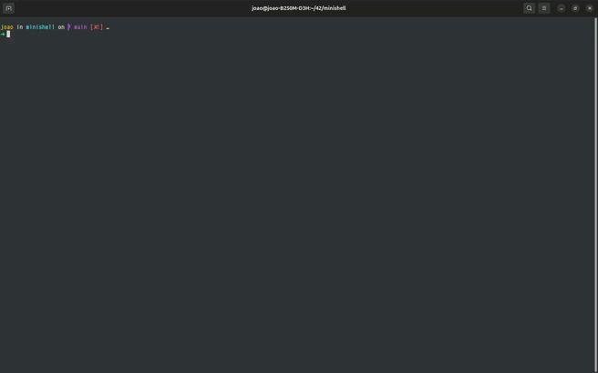

# 🐵 Minishell

```
   __  __ _       _     _     _          _ _ 
  |  \/  (_)     (_)   | |   | |        | | |
  | \  / |_ _ __  _ ___| |__ | |__   ___| | |
  | |\/| | | '_ \| / __| '_ \| '_ \ / _ \ | |
  | |  | | | | | | \__ \ | | | | | |  __/ | |
  |_|  |_|_|_| |_|_|___/_| |_|_| |_|\___|_|_|
```

Minishell is a simplified Unix shell implemented in C as part of the 42 curriculum. It aims to replicate essential shell functionalities, providing a hands-on understanding of how shells work internally.

The project plan is available [here](https://jcmspg.github.io/minishell/).




---

## Table of Contents
- [Minishell](#minishell)
- [Why Minishell?](#why-minishell)
- [Quick Demo](#quick-demo)
- [🚀 Features](#-features)
- [📦 Installation](#-installation)
- [🖥️ Usage](#-usage)
- [🧩 Built-in Commands](#-built-in-commands)
- [🌟 Wildcard Expansion](#-wildcard-expansion)
- [🗂️ Project Structure](#-project-structure)
- [⚠️ Limitations](#-limitations)
- [How It Works](#how-it-works)
- [🤝 Contributing](#-contributing)
- [👤 Authors](#-authors)
- [📄 License](#-license)

---

> **A fully functional Unix shell, written in C, featuring command parsing, pipelines, redirections, environment and wildcard expansion, and robust error/signal handling.**

[](https://www.linkedin.com/in/jooagmoz)
[](assets/demo.webm)

---

## Why Minishell?

Minishell is more than a school project—it's a demonstration of my ability to:
- **Design and implement complex systems in C**
- **Work with low-level process management, memory, and signals**
- **Recreate core Unix shell features from scratch**
- **Write robust, maintainable, and well-documented code**
- **Debug, test, and handle edge cases in real-world scenarios**

---

## Quick Demo

<!-- If you have a GIF or screenshot, add it here -->
<!--  -->

```sh
$ ./minishell
minishell$ echo Hello, world!
Hello, world!
minishell$ ls *.c | grep main
main.c
minishell$ export PATH=$PATH:/custom/bin
minishell$ exit
```

---


## 🚀 Features

- **Command execution:** Run external programs with arguments.
- **Built-in commands:** Includes `cd`, `echo`, `pwd`, `export`, `unset`, `env`, and `exit`.
- **Redirections:** Supports input (`<`), output (`>`), and append (`>>`) redirections.
- **Pipelines:** Chain commands using the pipe operator (`|`).
- **Environment variable expansion:** Handles `$VAR` and `$?` expansions.
- **Wildcard expansion:** Supports globbing with `*` (e.g., `ls *.c`).
- **Signal handling:** Properly manages signals like `Ctrl+C` and `Ctrl+D`.
- **Error handling:** Provides informative error messages for invalid commands or syntax.
- **Memory management:** Avoids memory leaks and ensures resource cleanup.

---

## 📦 Installation

1. **Clone the repository:**
    ```sh
    git clone https://github.com/jcmspg/minishell.git
    cd minishell
    ```
2. **Build the project:**
    ```sh
    make
    ```
    This will compile the source code and generate the `minishell` executable.

---

## 🖥️ Usage

Start the shell by running:
```sh
./minishell
```

You can now enter commands as you would in a standard shell. Examples:
```sh
ls *.c | grep main > results.txt
export PATH=$PATH:/custom/bin
cat < input.txt | sort | uniq
echo "Hello, $USER!"
ls src/*.c
```

**Debug Mode:**  
To see how your input is parsed and processed, run:
```sh
./minishell -d
```
This will print detailed debug information for each command entered.

You can now enter commands as you would in a standard shell. Examples:
```sh
ls *.c | grep main > results.txt
export PATH=$PATH:/custom/bin
cat < input.txt | sort | uniq
echo "Hello, $USER!"
ls src/*

---

## 🧩 Built-in Commands

| Command         | Description                       |
|-----------------|-----------------------------------|
| `cd [dir]`      | Change the current directory      |
| `echo [args...]`| Print arguments to standard output|
| `pwd`           | Print the current working directory|
| `export [VAR=VAL]` | Set environment variables     |
| `unset [VAR]`   | Remove environment variables      |
| `env`           | List environment variables        |
| `exit [status]` | Exit the shell                    |

---

## 🌟 Wildcard Expansion

Minishell supports **wildcard expansion** (globbing) in command arguments, similar to Bash:

- `*` matches any sequence of characters (except hidden files).

**Examples:**
```sh
ls *.c
echo src/*.h
```

---

## 🗂️ Project Structure

```
src/
  builtins/         # Built-in command implementations
  cmd_as_regular_user/
  env/              # Environment variable management
  frees/            # Memory management
  history/          # Command history
  inits/            # Shell initialization
  parsing/          # Command parsing and tokenization
  pipes/            # Pipe handling
  redirections/     # Redirection logic
  run/              # Main shell loop and execution
  signals/          # Signal handling
  utils/            # Utility functions
  validations/      # Command and argument validation
  wildcards/        # Wildcard/globbing logic
Makefile
README.md
```

---

## ⚠️ Limitations

- **Not Supported:**  
  - Logical OR (`||`), command separator (`;`), and process ID expansion (`$$`) are **not implemented**.
- **No job control:**  
  - Background jobs (`&`) and job control commands are not available.
- **No advanced Bash features:**  
  - No subshells, process substitution, or advanced scripting.

---


## How It Works

Minishell follows a classic shell architecture, processing user input in a loop and executing commands step by step:

```
+---------------------+
| 1. Prompt & Input   |
+---------------------+
            |
            v
+---------------------+
| 2. Lexing & Parsing |
+---------------------+
            |
            v
+---------------------+
| 3. Expansion        |
|   (env, wildcards)  |
+---------------------+
            |
            v
+---------------------+
| 4. Execution        |
|   (builtins/ext)    |
+---------------------+
            |
            v
+---------------------+
| 5. Cleanup & Loop   |
+---------------------+
```

### 1. Prompt & Input
- The shell displays a prompt and waits for user input.
- Input is read line-by-line, handling signals like `Ctrl+C` and `Ctrl+D`.

### 2. Lexing & Parsing
- The input line is split into tokens (words, operators, etc.).
- The parser builds a command structure, identifying commands, arguments, redirections, and pipes.

### 3. Expansion
- Environment variables (e.g., `$HOME`, `$?`) are expanded.
- Wildcards (`*`, `?`) are expanded to matching filenames using globbing.

### 4. Execution
- Built-in commands (`cd`, `echo`, etc.) are executed directly in the shell process.
- External commands are executed by forking a child process and using `execve`.
- Redirections and pipes are set up as needed.

### 5. Cleanup & Loop
- Resources are freed, and the shell returns to the prompt for the next command.

---

**Key Components:**
- **Parsing:** Converts user input into structured commands.
- **Expansion:** Handles variable and wildcard expansion.
- **Execution:** Runs built-in or external commands, managing processes and I/O.
- **Signal Handling:** Ensures the shell responds gracefully to user interrupts.
- **Error Handling:** Detects and reports syntax or runtime errors.

---

This modular approach makes it easy to extend Minishell with new features or built-ins, and ensures robust, predictable behavior similar to standard Unix shells.
## 🤝 Contributing

Contributions are welcome! Please open issues or submit pull requests for improvements or bug fixes.

---

## 👤 Authors

- João ([@jcmspg](https://github.com/jcmspg))
- [Your collaborators here]

---

## 📄 License

This project is licensed under the MIT License.

---

> The project plan is available [here](https://jcmspg.github.io/minishell/).

